# AIra CLI Business Flow Sequence Diagram

## Overview
This document illustrates the complete business flow of the AIra CLI application based on the index.js implementation.

## Business Flow Analysis

The AIra CLI follows a structured flow that can be broken down into several key phases:

1. **Initialization Phase** - Application startup and CLI argument parsing
2. **System Check Phase** - Prerequisites validation and system detection
3. **Agent Setup Phase** - Agent creation and configuration
4. **Interactive Phase** - User interaction loop with agent execution
5. **Session Management Phase** - Ongoing session handling and cleanup

## Mermaid Sequence Diagram

```mermaid
sequenceDiagram
    participant User
    participant CLI as AIra CLI
    participant Parser as Argument Parser
    participant Diagnostics as System Diagnostics
    participant Agent as Code Agent
    participant Ollama as LLM Service
    participant Renderer as Thought Renderer
    participant Tools as Tool Executor
    participant Telemetry as Telemetry System

    %% Initialization Phase
    User->>CLI: Start application
    CLI->>Parser: parseCliArgs()
    Parser-->>CLI: Parsed options (mode, sessionId, etc.)
    
    alt Mode is Health Check
        CLI->>Diagnostics: runHealthCheck()
        Diagnostics-->>CLI: Health report
        CLI-->>User: JSON health output
        CLI->>CLI: Exit
    else Mode is Diagnostics
        CLI->>Diagnostics: runDiagnostics()
        Diagnostics-->>CLI: Diagnostic results
        CLI-->>User: Diagnostic report
        CLI->>CLI: Exit
    else Mode is Interactive/Single
        %% System Check Phase
        opt Skip Startup Check is false
            CLI->>Diagnostics: runDiagnostics(silent=true)
            Diagnostics-->>CLI: Prerequisites check
            alt Prerequisites failed
                CLI-->>User: Error message
                CLI->>CLI: Exit with error code
            end
        end
        
        %% Agent Setup Phase
        CLI->>CLI: detectSystemInfo()
        CLI->>CLI: formatSystemPrompt()
        CLI->>CLI: createRefactorChain(ollama)
        CLI->>Agent: buildCodeAgent()
        Agent-->>CLI: Initialized agent
        CLI->>CLI: Setup readline interface
        
        %% Interactive Phase
        CLI-->>User: "AIra is ready. Type your request..."
        
        loop Interactive Session
            User->>CLI: User input
            CLI->>CLI: renderUserInput()
            CLI->>Renderer: createThoughtRenderer()
            Renderer->>Renderer: start("Analyzing request...")
            
            CLI->>Agent: runAgentTurn(input, sessionId)
            
            %% Agent Execution Flow
            Agent->>Telemetry: Start turn tracking
            Agent->>Agent: Check streaming support
            
            alt Streaming supported
                Agent->>Ollama: streamInvoke()
                loop Streaming events
                    Ollama-->>Agent: Stream chunk (messages/tasks)
                    Agent->>Renderer: handleStreamEvent()
                    alt Tool call detected
                        Renderer->>Tools: registerToolStart()
                        Tools->>Tools: Execute tool
                        Tools-->>Renderer: Tool result
                        Renderer->>Renderer: renderToolOutput()
                        Renderer->>Telemetry: finishToolInvocation()
                    else AI response chunk
                        Renderer->>Renderer: Display AI response
                    end
                end
            else No streaming
                Agent->>Ollama: invoke()
                Ollama-->>Agent: Complete response
                Agent->>Agent: extractAgentEvents()
                loop Agent events
                    Agent->>Renderer: playAgentTimeline()
                    alt Tool call event
                        Renderer->>Tools: Execute tool
                        Tools-->>Renderer: Tool result
                        Renderer->>Renderer: renderToolOutput()
                    else Thought event
                        Renderer->>Renderer: flash(thought text)
                    end
                end
            end
            
            Agent-->>CLI: Agent response
            CLI->>Renderer: succeed("Thought process complete")
            CLI-->>User: Formatted AI response
            
            %% Session Management
            Agent->>Telemetry: recordTurn()
            CLI->>CLI: getMemoryStatusText()
            CLI-->>User: Memory status display
            
            alt User wants to exit
                User->>CLI: "exit" command
                CLI-->>User: "AIra: Goodbye!"
                CLI->>CLI: Close readline and exit
            else User checks tokens
                User->>CLI: "/token" command
                CLI->>Agent: getTokenUsage()
                Agent-->>CLI: Token usage data
                CLI->>CLI: renderTokenUsage()
                CLI-->>User: Token usage display
            else Continue session
                CLI->>User: Prompt for next input
            end
        end
    end
    
    %% Error Handling and Cleanup
    opt Error occurs during execution
        Agent->>Renderer: fail(error message)
        Agent->>Telemetry: recordTurn(success=false, error)
        CLI->>CLI: Log error
        CLI-->>User: Error message
    end
    
    %% Process termination
    CLI->>CLI: Cleanup resources
    CLI->>Telemetry: Final telemetry flush
    CLI->>CLI: Process exit
```

## Key Flow Components

### 1. CLI Argument Processing
- Parses command-line arguments to determine execution mode
- Supports interactive, diagnostics, health-check, and single-shot modes
- Configures session ID and various options

### 2. System Validation
- Runs prerequisite checks before main execution
- Can auto-fix issues or provide detailed diagnostic reports
- Ensures system compatibility and required dependencies

### 3. Agent Initialization
- Detects system information for context
- Creates refactor chain with Ollama integration
- Builds code agent with configured recursion limits
- Sets up telemetry and logging

### 4. Interactive Execution Loop
- Captures user input via readline interface
- Renders user input in formatted blocks
- Executes agent turns with streaming support
- Displays thought process and tool execution in real-time

### 5. Tool Execution Flow
- Registers tool invocations with telemetry
- Executes tools with proper error handling
- Renders tool output in formatted preview blocks
- Tracks tool performance and success rates

### 6. Session Management
- Maintains session state across multiple turns
- Tracks token usage and memory consumption
- Provides session statistics and health monitoring
- Handles graceful shutdown and resource cleanup

## Error Handling Patterns

The application implements comprehensive error handling at multiple levels:
- Tool execution errors are caught and logged
- Agent failures trigger proper cleanup
- System validation failures prevent execution
- Stream interruptions are handled gracefully

## Performance Considerations

- Streaming support for real-time feedback
- Memory usage monitoring and display
- Token usage tracking for cost management
- Tool execution telemetry for performance analysis
- Configurable recursion limits to prevent infinite loops

## Integration Points

- **Ollama LLM**: Core AI reasoning and response generation
- **Tool System**: Extensible tool execution framework
- **Telemetry**: Performance and usage analytics
- **Diagnostics**: System health and prerequisite validation
- **CLI Interface**: User interaction and session management